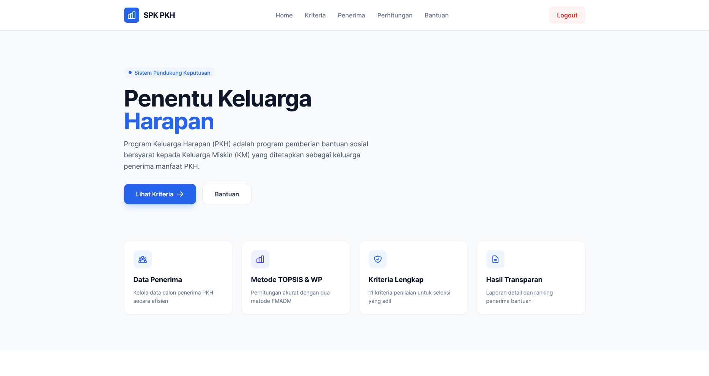

# Sistem Pendukung Keputusan PKH

Aplikasi **Sistem Pendukung Keputusan Penentu Keluarga Harapan** menggunakan metode **TOPSIS** dan **Weighted Product (WP)**.

## Tampilan Home



## Fitur Utama

- Manajemen data alternatif (calon penerima PKH)
- Perhitungan dan ranking dengan metode TOPSIS
- Perhitungan dan ranking dengan metode WP
- Dashboard perbandingan hasil perhitungan
- Halaman autentikasi (login/register)

## Versi Rilis

- `v1.0.0`  
  Versi pertama sebelum refactor besar (acuan legacy).
- `v2.0.0`  
  Versi refactor mayor dengan pembaruan arsitektur, tampilan, dan peningkatan UX.

## Branch Penting

- `main` -> versi terbaru (`v2.x`)
- `legacy-v1` -> baseline versi lama (`v1.0.0`)

## Menjalankan Project

1. Install dependency:
```bash
composer install
```

2. Salin environment:
```bash
copy .env.example .env
```

3. Atur konfigurasi database di file `.env`.

4. Jalankan migrasi schema (opsional, jika dibutuhkan):
```bash
php migrate_schema.php
```

5. Jalankan web server lokal (contoh Laragon/Apache), lalu akses aplikasi dari browser.
